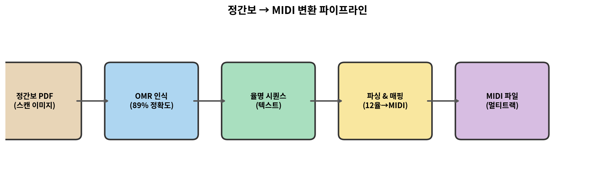
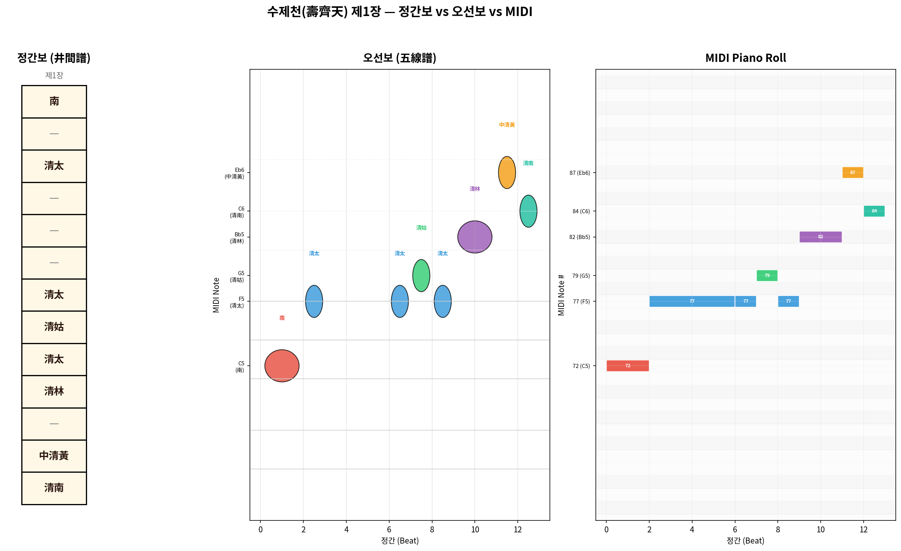
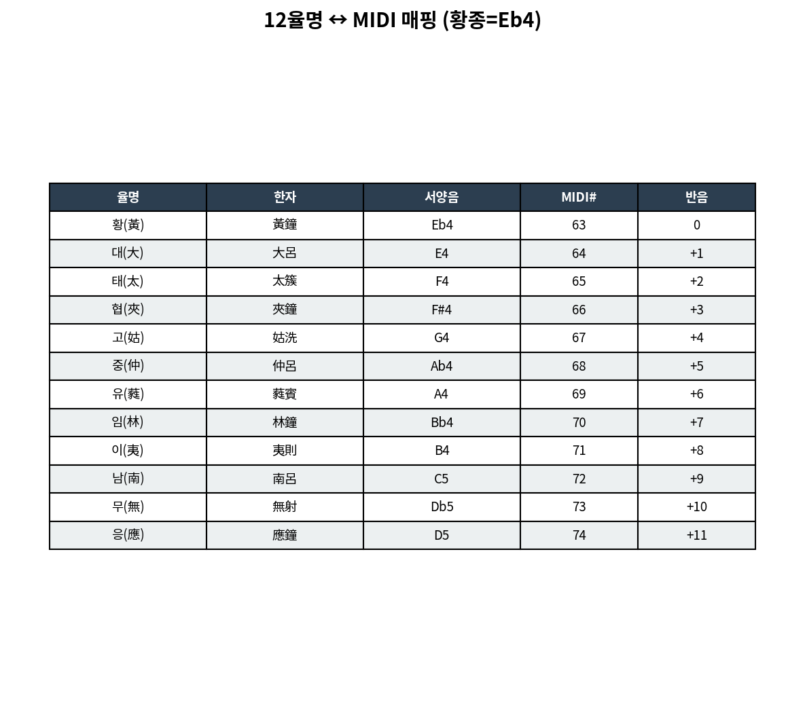
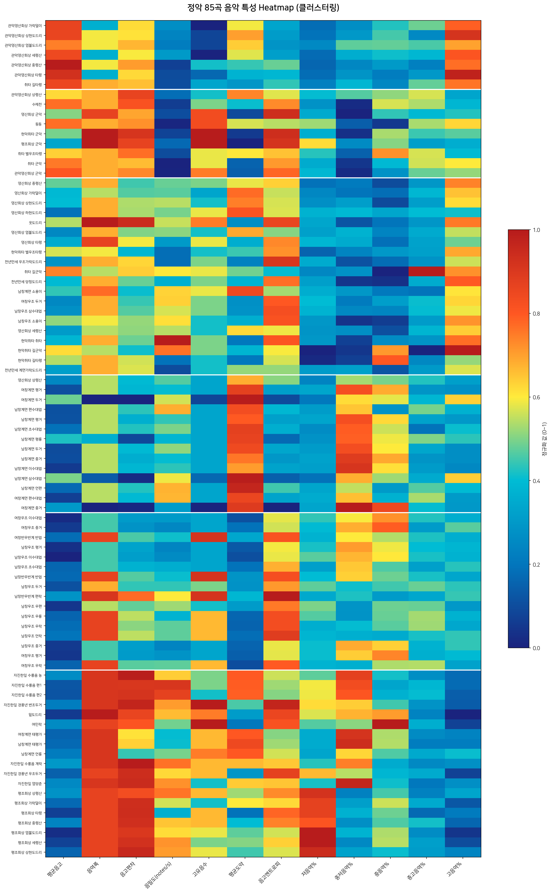
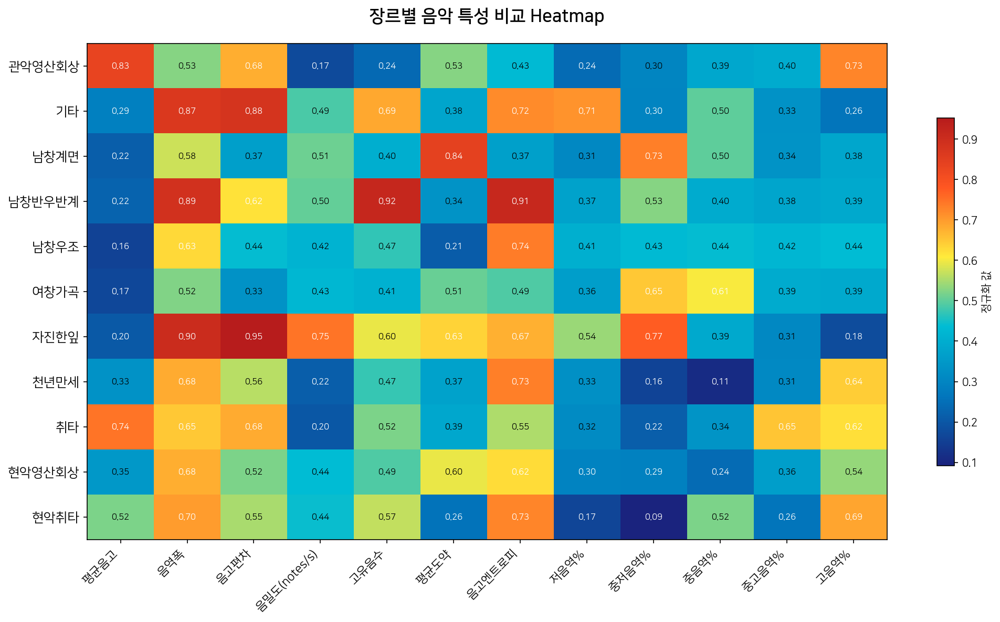
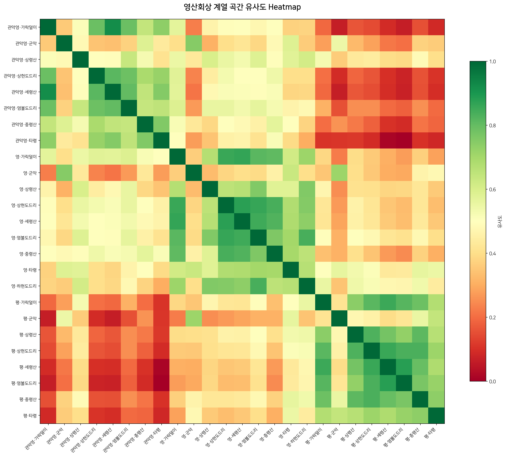
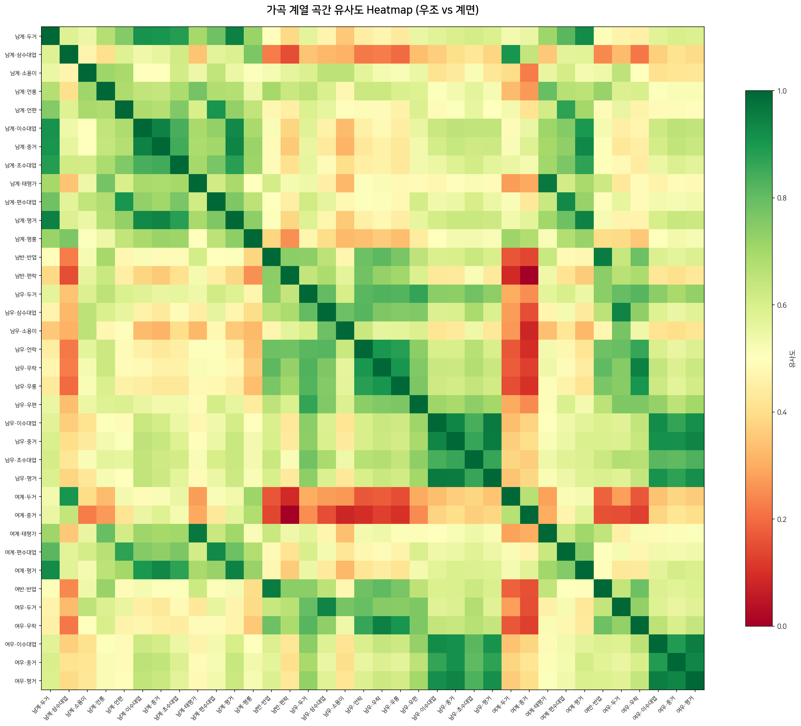
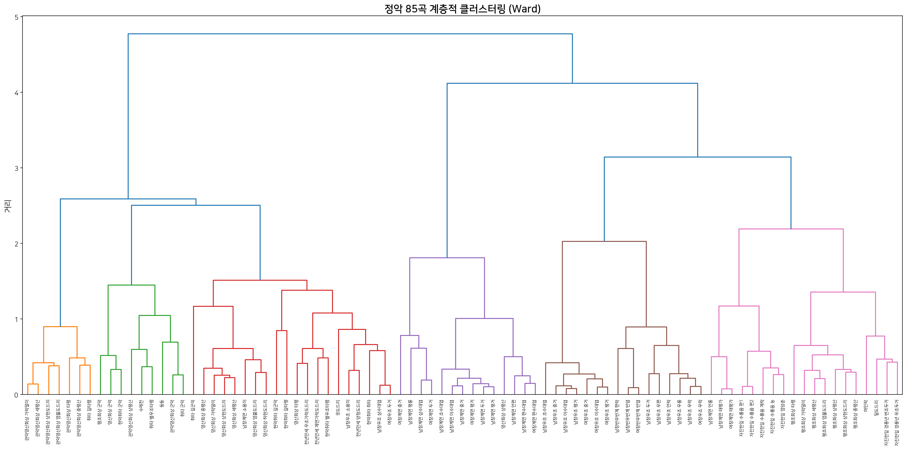

# 정간보 → MIDI 변환기 (Jeongganbo-to-MIDI Converter)

[](https://opensource.org/licenses/MIT)
[](https://www.python.org/downloads/)
[](#-변환-결과)

> 한국 전통 궁중음악의 **정간보(井間譜)** 표기법을 **MIDI**로 변환하는 최초의 오픈소스 파이프라인



## 🎵 정간보란?

**정간보(井間譜)**는 세종대왕이 1447년 창안한 동양 최초의 유량악보(有量樂譜)입니다. 우물 정(井)자 모양의 칸에 율명(律名)을 적어 음높이와 박자를 동시에 표기합니다.

| 특징 | 정간보 | 오선보 |
|------|--------|--------|
| 읽는 방향 | 위→아래, 오른쪽→왼쪽 | 왼쪽→오른쪽 |
| 음높이 | 12율명 (黃太仲林...) | 음자리표 + 음표 위치 |
| 박자 | 칸(정간) 개수 = 박수 | 음표 모양 (♩♪♫) |
| 장식음 | 시김새 부호 (요성, 퇴성 등) | 트릴, 글리산도 등 |

## 📊 변환 예시: 수제천(壽齊天) 제1장

수제천은 백제 정읍사에서 유래한 한국 최고(最古)의 관악 합주곡(계면조)입니다.

아래는 수제천 첫 장단의 **정간보 → 오선보 → MIDI 피아노롤** 비교입니다:



**왼쪽**: 정간보 원본 — 칸 안의 한자가 율명(음높이), 칸 수가 박자  
**가운데**: 서양 음고-시간 표기 — 같은 선율을 음높이(Y축) × 시간(X축)으로 표현  
**오른쪽**: MIDI 피아노롤 — DAW에서 보이는 최종 결과물

## 🎹 12율명 ↔ MIDI 매핑

한국 전통 12율(十二律)을 MIDI 노트 번호로 변환합니다. 황종(黃鐘) 기준음은 선택 가능합니다.



| 기준음 설정 | 황종 = | 용도 |
|-------------|--------|------|
| `hwang_pitch=63` | Eb4 | 궁중 정악 (기본값) |
| `hwang_pitch=60` | C4 | 현대 교육용 |
| `hwang_pitch=58` | Bb3 | 향악/민속악 |

### 옥타브 표기

| 접두사 | 의미 | 옥타브 | 예시 |
|--------|------|--------|------|
| (없음) | 기본 | 0 | 黃 = Eb4 (MIDI 63) |
| 청(淸) | 맑은 소리 | +1 | 清黃 = Eb5 (MIDI 75) |
| 중청(重淸) | 더 맑은 | +2 | 重清黃 = Eb6 (MIDI 87) |
| 배(倍) | 낮은 소리 | -1 | 倍黃 = Eb3 (MIDI 51) |

## 📦 변환 결과

**85곡**의 한국 궁중정악을 정간보 OMR 데이터에서 MIDI로 변환했습니다.

| 항목 | 수치 |
|------|------|
| 변환 곡 수 | **85곡** |
| 총 음표 수 | **105,626개** |
| 총 재생시간 | **89.4시간** |
| 트랙 구성 | 4~6트랙 (대금/피리/해금/아쟁/가야금/거문고) |
| OMR 정확도 | ~89% (MALerLab jeongganbo-omr 기반) |

### 포함 레퍼토리

| 분류 | 곡목 | 곡수 |
|------|------|------|
| 영산회상 | 상령산, 중령산, 세령산, 가락덜이, 상현도드리, 염불도드리, 타령, 군악, 하현도드리 | 9 |
| 관악영산회상 | 상령산~군악 (위와 같은 구성) | 8 |
| 평조회상 | 상령산~타령 | 8 |
| 수제천(壽齊天) | 백제 최고(最古) 관악합주 | 1 |
| 여민락(與民樂) | 세종대왕 작곡, 14,052 notes | 1 |
| 동동(動動) | 고려가요 기악곡 | 1 |
| 남창 가곡 | 우조/계면 초수대엽~태평가 | 20+ |
| 여창 가곡 | 우조/계면 | 8 |
| 취타/현악취타 | 군악, 길군악, 길타령, 별우조타령 | 9 |
| 자진한잎 | 경풍년, 수룡음, 염양춘 | 7 |
| 천년만세 | 양청/계면/우조 가락도드리 | 3 |
| 밑도드리/웃도드리 | 관현악 합주 | 2 |

### 악기별 GM MIDI 매핑

| 국악기 | GM Instrument | GM# | 옥타브 보정 |
|--------|---------------|-----|-------------|
| 대금 (大笒) | Flute | 73 | +1 |
| 피리 (觱篥) | Oboe | 68 | 0 |
| 해금 (奚琴) | Fiddle | 110 | 0 |
| 아쟁 (牙箏) | Cello | 42 | -1 |
| 가야금 (伽倻琴) | Nylon Guitar | 25 | 0 |
| 거문고 (玄琴) | Steel Guitar | 24 | -1 |

## 🚀 사용법

### 요구사항

```bash
pip install mido
```

### 단일 시퀀스 변환

```python
from scripts.jeongganbo_converter import JeongganboConverter

conv = JeongganboConverter(hwang_pitch=63)  # Eb4 기준

# 율명 시퀀스: (율명, 정간수, 옥타브)
sequence = [
    ('황', 2, 0),   # 황종 2박
    ('태', 1, 0),   # 태주 1박
    ('중', 1, 0),   # 중려 1박
    ('임', 2, 0),   # 임종 2박
    ('황', 4, 1),   # 청황종 4박 (1옥타브 위)
]

conv.sequence_to_midi(sequence, "output.mid", bpm=60)
```

### 텍스트 파싱

```python
conv = JeongganboConverter(hwang_pitch=63)
seq = conv.parse_simple_notation("황2 태 중 임2 황+1")
conv.sequence_to_midi(seq, "output.mid", bpm=60)
```

### OMR 결과 → MIDI 일괄 변환

```bash
# 싱글트랙 (모든 악기 합쳐서)
python scripts/omr_to_midi.py

# 멀티트랙 (악기별 분리)
python scripts/omr_to_midi_multitrack.py
```

## 📁 프로젝트 구조

```
jeongganbo-midi/
├── README.md
├── LICENSE
├── scripts/
│   ├── jeongganbo_converter.py    # 핵심: 율명→MIDI 변환 엔진
│   ├── omr_to_midi.py             # OMR→MIDI 싱글트랙 변환
│   ├── omr_to_midi_multitrack.py  # OMR→MIDI 멀티트랙 변환
│   ├── sujecheon_test.py          # 수제천 테스트 스크립트
│   └── generate_comparison.py     # 비교 이미지 생성
├── midi/
│   ├── single/                    # 싱글트랙 MIDI (85곡)
│   ├── multitrack/                # 멀티트랙 MIDI (85곡)
│   ├── sujecheon_piri.mid         # 수제천 피리 (수동 입력 테스트)
│   ├── sujecheon_daegeum.mid      # 수제천 대금 (수동 입력 테스트)
│   └── test_*.mid                 # 스케일/조성 테스트
└── docs/
    └── images/
        ├── comparison_sujecheon.png  # 3-way 비교
        ├── yulname_midi_mapping.png  # 12율명 매핑표
        └── pipeline.png             # 파이프라인 다이어그램
```

## 📊 정악 85곡 음악 특성 Heatmap 분석

> **핵심 요약**: 85곡의 정악은 음고·음역·밀도·엔트로피 등 12개 특성으로 분석하면 **영산회상·가곡·취타·도드리** 4대 계열로 자연 클러스터링되며, 같은 계열 내에서는 편성(현악/관악)보다 **선율 구조(악조·악장)**가 유사도를 결정하는 핵심 요인입니다.

### 전체 85곡 특성 Heatmap (클러스터링)



12개 음악 특성으로 85곡을 Ward 클러스터링. 유사한 곡끼리 자동 그룹화됩니다.

### 장르별 평균 특성 비교



12개 장르의 평균 특성값 비교. 관악영산회상/현악영산회상/평조회상은 편성만 다를 뿐 선율 구조가 거의 동일합니다.

### 영산회상 계열 곡간 유사도



현악·관악·평조 영산회상 24곡 간의 유사도. 같은 악장(상령산↔상령산)끼리 편성을 초월한 높은 유사도를 보입니다.

### 가곡 계열 유사도 (우조 vs 계면)



남창/여창 우조·계면 가곡 간 유사도. **우조와 계면이 명확하게 분리**되며, 같은 조 내에서는 남창/여창 차이가 작습니다.

### 계층적 클러스터링 Dendrogram



Ward 방법 기반 계층적 클러스터링. 장르 경계가 자연스럽게 드러납니다.

### 주요 발견

| # | 발견 | 의미 |
|---|------|------|
| 1 | 영산회상 3계열(현악·관악·평조)이 같은 악장끼리 클러스터 | 편성보다 선율이 유사도 결정 |
| 2 | 가곡이 우조/계면으로 명확히 분리 | 악조(mode)가 최대 차별화 요인 |
| 3 | 취타/현악취타가 독립 클러스터 형성 | 군악 특유의 높은 음밀도·넓은 음역 |
| 4 | 여민락이 독자적 위치 (14,052 notes, 128분) | 한국 정악 중 최대 규모 |
| 5 | 수제천·동동이 최저 음밀도 그룹 | 가장 느리고 장중한 정악의 정수 |

> 📥 **[분석 PPTX 다운로드](정악_85곡_음악특성_Heatmap분석.pptx)** — 7장 슬라이드, 상세 분석 포함

## 📜 연대기 타임라인 (Chronological Timeline)

> 91곡의 역사적 기원을 시대순으로 정리합니다. 연대는 학술적 추정치이며, 정확한 작곡 연도가 불명인 곡이 많습니다.

```
백제(~660)  고려(918~1392)  조선초기(1392~1500)  조선중기(1500~1650)  조선후기(1650~1910)
  ●━━━━━━━━━━●━━━━━━━━━━━━●━━━━━━━━━━━━━━━━●━━━━━━━━━━━━━━━━━●
  │           │             │                 │                   │
  수제천      동동·보허자    여민락·취타       가곡 원형            영산회상 파생곡
  (정읍사)    (궁중무악)    (세종대왕)        (초수대엽)           가곡 확대·여창
```

### 시대별 상세

| 시대 | 추정연대 | 곡명 | 비고 |
|------|---------|------|------|
| **백제** | ~600 | 수제천 | 백제 정읍사(井邑詞)에서 유래. 현존 최고(最古) 관악합주곡 |
| **고려** | ~1100 | 동동 | 고려시대 궁중 무악(舞樂). 고려가요 동동에 맞춘 춤곡 |
| **고려(송나라 전래)** | ~1114 | 보허자 | 송나라 대성아악에서 전래(1114). 당악 계통의 대표곡 |
| **조선 세종** | ~1447 | 여민락 | 세종대왕이 용비어천가 선율에 맞춰 작곡(1447) |
| **조선 초기** | ~1450 | 영산회상 상령산 | 불교 영산회상불보살(靈山會上佛菩薩)에서 유래 |
|  |  | 취타 취타 | 군례(軍禮) 행진음악. 대취타에서 유래 |
| **조선 중기** | ~1580 | 남창우조 초수대엽 | 가곡의 원형. 만대엽→중대엽→삭대엽으로 발전 |
| **조선 중기** | ~1600 | 영산회상 중령산 외 8곡 | 상령산 변주·가곡 초기형·염양춘 |
| **조선 중기** | ~1650 | 영산회상 상현/하현도드리 | 도드리(환입) 계열 파생곡 |
| **조선 후기** | ~1700 | **52곡** | 영산회상 파생, 관악영산회상, 가곡 남창/여창, 자진한잎, 취타 등 |
| **조선 후기** | ~1720 | 평조회상 8곡 | 영산회상을 평조(우조)로 이조 |
| **조선 후기** | ~1750 | 천년만세 3곡 외 12곡 | 현악취타, 반우반계, 소용이 등 후기 파생곡 |

### 시대별 곡 수

| 시대 | 곡 수 | 비율 |
|------|-------|------|
| 백제 | 1곡 | 1% |
| 고려 | 2곡 | 2% |
| 조선 세종 | 1곡 | 1% |
| 조선 초기 | 2곡 | 2% |
| 조선 중기 | 11곡 | 12% |
| 조선 후기 | 74곡 | 81% |
| **합계** | **91곡** | **100%** |

> 💡 **핵심 발견**: 91곡 중 81%가 조선 후기(1650~1910)에 완성된 형태로, 이 시기가 **정악의 황금기**였음을 보여줍니다. 그러나 그 뿌리는 백제(수제천, ~600년)·고려(동동·보허자)까지 **1,400년**을 거슬러 올라갑니다.

<details>
<summary>📋 전체 91곡 상세 연대표 (클릭하여 펼치기)</summary>

> 상세 테이블은 [`docs/timeline_full.md`](docs/timeline_full.md)를 참조하세요.

</details>

## ⚠️ 알려진 한계

| 한계 | 설명 | 개선 방향 |
|------|------|-----------|
| **시김새 미반영** | 요성, 퇴성, 추성 등 장식음이 MIDI에 포함되지 않음 | Pitch Bend로 구현 예정 |
| **OMR 오류** | 원본 OMR 89% 정확도 → ~11% 오인식 가능 | 수동 교정 + 모델 개선 |
| **템포 고정** | 모든 곡 BPM 25 고정 | 곡별 템포 메타데이터 추가 |
| **GM 음색 한계** | 서양 악기 음색으로 대체 | SoundFont/샘플러 연동 |

## 🔮 로드맵

- [ ] **v1.1**: 시김새(장식음) → Pitch Bend 변환
- [ ] **v1.2**: 곡별 실제 템포/장단 적용
- [ ] **v2.0**: 정간보 이미지 → MIDI 직접 변환 (End-to-End)
- [ ] **v2.1**: 웹 기반 변환 앱 (업로드 → 미리듣기 → 다운로드)
- [ ] 한국 전통 악기 SoundFont 연동
- [ ] 민속악(산조, 시나위 등) 정간보 지원

## 📚 참고

- **MALerLab/jeongganbo-omr** — 정간보 OMR 프레임워크 ([논문](https://dl.acm.org/doi/10.1145/3715159))
- **국립국악원 정악보** — 가야금/거문고/대금/아쟁/피리/해금 정악보 (2021)
- **depth221/Jeongganbo-editor** — 정간보 에디터 (율명 매핑 참조)

## 📄 라이선스

MIT License

OMR 데이터 출처: [MALerLab/jeongganbo-omr](https://github.com/MALerLab/jeongganbo-omr) (학술 연구용 데이터셋)

---

**🇰🇷 세종대왕이 1447년에 만든 악보가 2026년에 MIDI가 되었습니다.**
